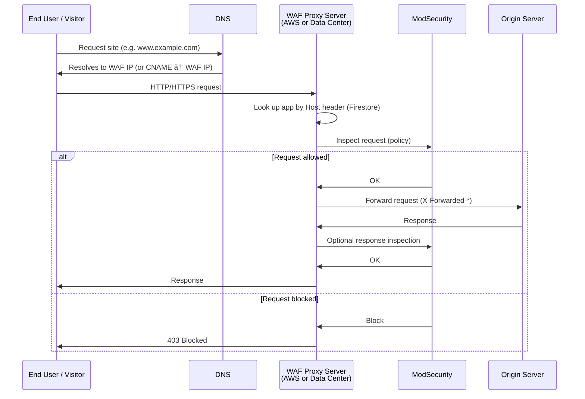
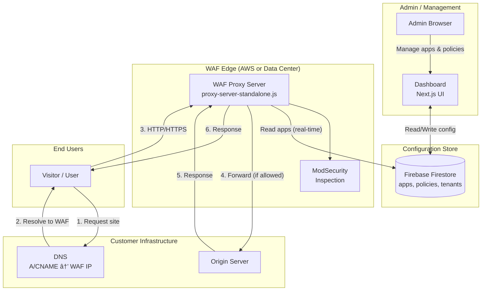
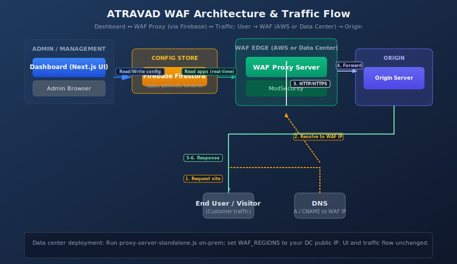

# ATRAVA Defense Architecture & Connection Diagram

This document describes how the **Dashboard (UI)**, **WAF Proxy Server**, and **traffic** connect—whether the WAF proxy runs in **AWS** or in your **data center**.

---

## Is Data Center Deployment Possible?

**Yes.** The WAF proxy server is a standard Node.js application. You can run it:

- **In AWS** (e.g. EC2 with a public IP or behind a load balancer)
- **In your data center** (on-premises), as long as:
  1. The proxy has a **public IP** (or sits behind a load balancer / firewall that has one) so customers can point DNS to it.
  2. The proxy can reach **Firebase** (Firestore) over the internet for application and policy config.
  3. Ports **80** and **443** are available (or your chosen HTTP/HTTPS ports).

No change to the Dashboard or app logic is required. You only set `WAF_REGIONS` (in the Dashboard’s environment) to the **data center proxy’s public IP** (and optional CNAME) so the UI shows customers the correct “point DNS here” value.

---

## High-Level Architecture

```
┌─────────────────────────────────────────────────────────────────────────────────┐
│                           ATRAVA Defense SYSTEM                                       │
├─────────────────────────────────────────────────────────────────────────────────┤
│                                                                                   │
│   ┌──────────────┐         ┌──────────────┐         ┌──────────────────────┐   │
│   │   Browser    │         │   Firebase   │         │  WAF Proxy Server    │   │
│   │  (Admins)    │────────▶│  (Config)    │◀────────│  (AWS or Data Center) │   │
│   └──────┬───────┘         └──────────────┘         └───────────┬──────────┘   │
│          │                            ▲                         │               │
│          │                            │                         │               │
│          ▼                            │                         ▼               │
│   ┌──────────────┐                    │                 ┌──────────────┐       │
│   │  Dashboard  │────────────────────┘                 │  Origin      │       │
│   │  (Next.js   │  Reads/writes apps,                  │  Servers     │       │
│   │   UI)       │  policies, tenants                    │  (Customer)  │       │
│   └─────────────┘                                      └──────────────┘       │
│                                                                                   │
└─────────────────────────────────────────────────────────────────────────────────┘
```

---

## 1. Dashboard ↔ WAF Proxy (Indirect via Firebase)

The **Dashboard (UI) does not talk directly to the WAF proxy**. Both use **Firebase (Firestore)**:

| Component      | Role |
|----------------|------|
| **Dashboard**  | Admins create/update **applications** (domain, origin URL, policy). Stored in Firestore. |
| **WAF Proxy**  | Reads **applications** from Firestore (by tenant). Real-time listener picks up changes. |
| **WAF_REGIONS**| In the Dashboard env: list of regions with **IP** (and CNAME). That IP is what customers point DNS to (your AWS or data center proxy). |

So: **UI → Firestore ← WAF Proxy**. The “connection” from UI to WAF is: *same Firestore data*.

```mermaid
flowchart LR
    subgraph Admin
        Browser[Browser]
    end
    subgraph ATRAVAD["ATRAVAD Platform"]
        UI[Dashboard UI\nNext.js]
        Firebase[(Firebase\nFirestore)]
        WAF[WAF Proxy Server\nAWS or Data Center]
    end
    subgraph Customer
        Origin[Origin Server]
    end

    Browser -->|"1. Login, manage apps"| UI
    UI -->|"2. Read/Write apps, policies"| Firebase
    WAF -->|"3. Read apps (real-time)"| Firebase
    WAF -->|"4. Forward clean traffic"| Origin
```



---

## 2. ATRAVA Defense Traffic Flow (User → WAF → Origin)

**End-user traffic** (your customers’ visitors) never hits the Dashboard. It goes: **User → DNS → WAF Proxy → ModSecurity → Origin (or block)**.



**Flow summary:**

1. Customer points **DNS** (A or CNAME) to your **WAF proxy’s public IP** (AWS or data center).
2. **Traffic** goes to the WAF proxy (HTTP/80, HTTPS/443).
3. Proxy looks up **application** by `Host` (from Firestore).
4. **ModSecurity** inspects request (and optionally response); block or allow.
5. If allowed, proxy **forwards** to **origin**; response goes back through the proxy to the user.

---

## 3. Full System Diagram (UI + Traffic)

Combined view: **admin path** (Dashboard ↔ Firebase ↔ WAF config) and **traffic path** (User → WAF → Origin).



---

## 4. Data Center vs AWS (Same Logic)

Deployment location only changes **where** the proxy runs and **which** IP you put in `WAF_REGIONS`.

| Aspect           | AWS                         | Data Center                          |
|-----------------|-----------------------------|--------------------------------------|
| **Run**         | EC2 (or ECS/Lambda, etc.)   | VM or physical server                |
| **Public IP**   | EC2 public IP or ELB        | DC public IP or LB in front of proxy |
| **Firebase**    | Outbound internet           | Outbound internet (allow Firestore)  |
| **Dashboard**   | `WAF_REGIONS=[{..., "ip": "AWS_IP"}]` | `WAF_REGIONS=[{..., "ip": "DC_IP"}]` |
| **Traffic**     | User → AWS → Origin         | User → Data Center → Origin          |

**Data center checklist:**

1. Install Node.js, run `proxy-server-standalone.js` (same as in AWS).
2. Configure **Firebase Admin** (env vars or service account) so the proxy can read Firestore.
3. Expose **80/443** (or your ports) and assign a **public IP** (or CNAME that resolves to that IP).
4. In the **Dashboard** `.env.local`, set `WAF_REGIONS` to that IP (and optional CNAME).
5. Customers point **DNS** to that IP (or CNAME). Traffic flow is as in the diagrams above.

**Full step-by-step:** See [Data Center WAF Deployment](./DATA_CENTER_WAF_DEPLOYMENT.md) for prerequisites, Firebase setup, env vars, PM2/systemd, SSL (Nginx), and Dashboard `WAF_REGIONS`.

---

## 5. Quick Reference: What Connects to What

| From           | To              | Purpose |
|----------------|-----------------|---------|
| **Dashboard**  | **Firebase**    | Read/write apps, policies, tenants. |
| **Dashboard**  | **WAF Proxy**  | No direct connection. Dashboard only shows WAF IP from `WAF_REGIONS`. |
| **WAF Proxy**  | **Firebase**    | Read applications (and policies) for routing and ModSecurity. |
| **WAF Proxy**  | **Origin**      | Forward allowed requests. |
| **User**       | **WAF Proxy**   | All site traffic (DNS points to WAF IP). |
| **User**       | **Dashboard**   | Only when admins open the dashboard in a browser. |

---

## Summary

- **Yes, you can run the WAF proxy in your data center.** Same code as AWS; you only need a public IP (or LB), Firebase access, and ports 80/443.
- **UI “connection” to the WAF proxy** is via **Firestore**: Dashboard writes app config, proxy reads it. No direct UI ↔ proxy link.
- **ATRAVA Defense traffic** is: **User → DNS (WAF IP) → WAF Proxy (AWS or Data Center) → ModSecurity → Origin** (or block at WAF).

Use the Mermaid diagrams in this doc (e.g. in GitHub or a Mermaid-capable viewer) for the connection and traffic visuals.

---

## Visual Diagram (SVG)

A standalone visual of the same architecture is in the repo:



Open `docs/atravad-waf-architecture.svg` in a browser or editor to view the full diagram: **Admin → Firebase**, **WAF Proxy (AWS or Data Center) → Firebase**, and **User → DNS → WAF → Origin** traffic flow.

